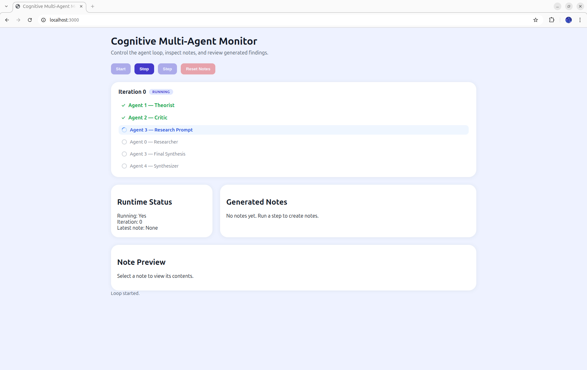

# Cognitive Multi-Agent Research Loop

A local multi-agent research loop that uses a local LLM (Ollama / Qwen2) to run five specialized agents in sequence. Each iteration produces Markdown notes that accumulate into a growing knowledge base. A React frontend provides real-time WebSocket-driven progress tracking, dynamic controls, and a live note viewer.



## Quick summary

- **Backend:** Flask + Flask-SocketIO API (`backend/`) running on eventlet. Orchestrates the agent pipeline and persists Markdown notes to `backend/notes/`.
- **Frontend:** React + Vite app (`frontend/`) — live step progress via WebSocket, dynamic button states, and auto-refreshing note viewer.
- **LLM backend:** Local Ollama instance (configurable via `OLLAMA_BASE_URL` and `OLLAMA_MODEL`).
- **Web grounding:** DuckDuckGo search + BeautifulSoup page excerpts injected into prompts each iteration.

## Architecture & agent responsibilities

Each iteration the orchestrator runs five agents in a fixed pipeline. Agent 3 appears twice — once to formulate the research prompt, and once to write the final synthesis after Agent 0 returns.

```
Context (framework + recent notes + web search)
    │
    ▼
Agent 1 — Theorist          → theory.md (Hypothesis / Mechanism / Implications)
    │
    ▼
Agent 2 — Critic            → critique.md (Weaknesses / Alternatives / Refinements)
    │
    ▼
Agent 3 — Research Prompt   → research_prompt.md (Core Questions + Search Directions)
    │
    ▼
Agent 0 — Researcher        → agent0_feedback.md (web search + evidence report)
    │
    ▼
Agent 3 — Final Synthesis   → synthesis.md (Synthesis / Master Theory / Open Questions)
    │
    ▼
Agent 4 — Synthesizer       → agent4_framework.md (updated framework for next iteration)
```

### Agent details

- **Agent 0 — Researcher**
  Receives Agent 3's focused research prompt, executes DuckDuckGo searches using the `## Search Directions`, fetches and excerpts page content, and returns a `# Research Findings` report that distinguishes new territory from what is already in the framework.

- **Agent 1 — Theorist**
  Proposes a high-level, testable cognitive theory grounded in psychology, neuroscience, genetics, mathematics, and philosophy. Output includes `Hypothesis`, `Mechanism`, and `Implications` sections.

- **Agent 2 — Critic**
  Interrogates Agent 1's theory for logical gaps, untested assumptions, and edge cases. Produces at least three weaknesses, at least one alternative explanation, and concrete suggested refinements.

- **Agent 3 — Neutral Assessor** (two passes per iteration)
  *First pass:* identifies what is genuinely NOT yet covered by the existing framework and produces a focused research prompt with `## Core Questions` and `## Search Directions`.
  *Second pass:* integrates Agent 1, Agent 2, and Agent 0 outputs into a balanced `# Synthesis` note with `## Master Theory` and `## Open Questions`.

- **Agent 4 — Synthesizer**
  Ingests all notes to update the long-running `agent4_framework.md`. This document is the seed context for the next iteration, so the framework grows richer over time without changing model weights.

## Real-time WebSocket progress

The backend emits Socket.IO events during each iteration so the frontend updates live without polling:

| Event | Payload | Purpose |
|---|---|---|
| `agent_progress` | `{ step, status, label, iteration }` | per-agent `running` / `done` / `error` |
| `status_update` | `{ running, iteration, latest_note, findings, current_step }` | overall orchestrator state |
| `notes_update` | `{ notes }` | updated note list after each write |

The progress panel appears as soon as the first agent fires and shows a spinner on the active step and checkmarks on completed ones. All control buttons update dynamically: **Start** and **Step** are disabled while an iteration is running; **Stop** is disabled when the loop is idle.

## Session file naming

Session notes are written as `session_00000001.md`, `session_00000002.md`, … (zero-padded to 8 digits) so they sort correctly in both the filesystem and the frontend note list regardless of how many iterations have accumulated. The note list also uses a numeric natural-sort key internally.

## REST API

| Method | Path | Description |
|---|---|---|
| `GET` | `/api/status` | Runtime state, current step, and latest findings |
| `POST` | `/api/start` | Start the continuous orchestrator loop |
| `POST` | `/api/stop` | Stop the loop after the current iteration |
| `POST` | `/api/step` | Run exactly one iteration (synchronous) |
| `GET` | `/api/notes` | List all generated notes (naturally sorted) |
| `GET` | `/api/notes/<name>` | Fetch note content |
| `GET` | `/api/notes/<name>/download` | Download note as a file |
| `POST` | `/api/reset` | Delete all notes and reset the iteration counter |

## Running the project

### Docker Compose (recommended)

```bash
docker compose up --build
```

- Frontend: `http://localhost:3000`
- Backend API: `http://localhost:5000/api/status`

The Vite dev server proxies both `/api` and `/socket.io` to the backend container, so the browser only needs to reach port 3000.

### Local (Python + Node)

**Backend:**

```bash
python3 -m venv .venv
source .venv/bin/activate
pip install -r backend/requirements.txt
python backend/run.py
```

**Frontend:**

```bash
cd frontend
npm install
npm run dev
```

## Configuration

| Variable | Default | Description |
|---|---|---|
| `OLLAMA_BASE_URL` | `http://127.0.0.1:11434` | Ollama API base URL |
| `OLLAMA_MODEL` | `qwen2.5:7b` | Model identifier |

When running in Docker, set `OLLAMA_BASE_URL=http://host.docker.internal:11434` (already set in `docker-compose.yml`).

## Troubleshooting

- **WebSocket 500 on `/socket.io`** — make sure `eventlet` is installed (`pip install eventlet`) and that `run.py` calls `eventlet.monkey_patch()` before any other import.
- **Repeated identical outputs** — check that `backend/notes/agent4_framework.md` is changing between iterations. A static framework yields nearly identical prompts.
- **`ImportError` for `duckduckgo_search`** — the package API can differ across versions. Pin the version in `requirements.txt` or replace `search.py` with another provider (arXiv, PubMed, Brave Search API).
- **Ollama connectivity** — confirm `OLLAMA_BASE_URL` is reachable and the Ollama daemon is running before starting the loop.

## Extending this project

- Add **Agent 5 — Experimentalist** to run lightweight computational experiments (toy simulations, ablations) to test hypotheses before synthesizing.
- Replace flat-file note storage with a **vector database** (Chroma, Milvus) for semantic retrieval and richer context selection.
- Add a **streaming LLM endpoint** and forward token-by-token output over the WebSocket so in-progress agent text is visible in real time.
- Wire up **arXiv / PubMed APIs** in `search.py` for higher-quality grounding than general web search.

## Contributing

Small, focused pull requests are welcome — especially those that improve grounding quality, add tests, or make prompts more robust.

## License

Add a `LICENSE` file (e.g., MIT) before publishing the repository.
